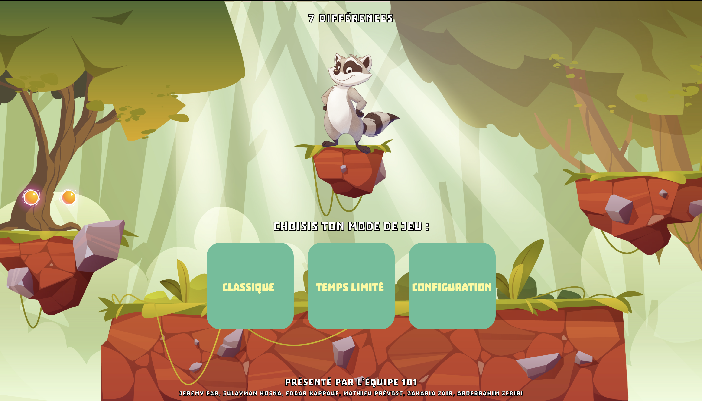
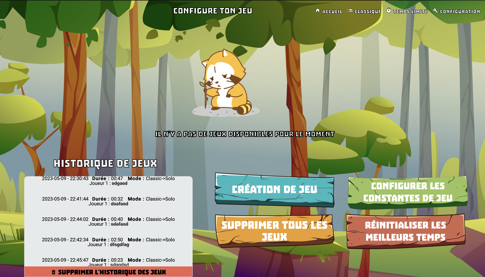
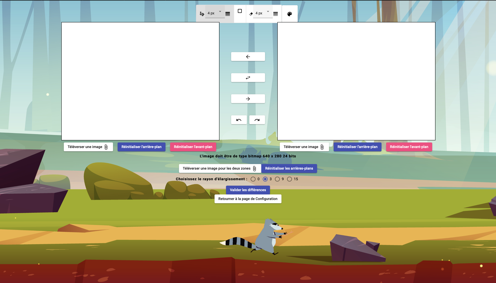
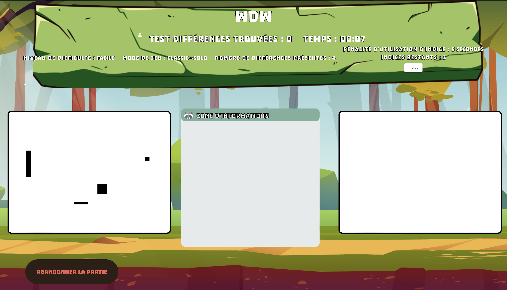

# 7 Differences Game

This is an online multiplayer game where players have to find the differences between two images. The game offers two distinct game modes: classic mode and cooperative mode. It was developed using the MANN stack (MongoDB, Angular, Node.js, and Nest.js).

## Classic Mode
In classic mode, players compete against each other to find the differences between the two images . The player who finds the highest number of differences wins the game.

## Cooperative Mode
In cooperative mode, players work together as a team to find all the differences between the two imagesas quickly as possible. They must collaborate and communicate effectively to successfully identify all the differences within the given time.

## Technologies Used
The game utilizes the following technologies:

- **MongoDB**: Used as a database to store game data pointers, player scores, performances, and game configurations.
- **Angular**: Used for the development of the game's frontend (client), providing an interactive and responsive experience for players.
- **Node.js**: Used as the server-side runtime environment.
- **Nest.js**: Based on Node.js and Express, Nest.js is used for the development of the dynamic game server, providing advanced architecture and route management features.

## Screenshots
Here are some screenshots of the application:
| **Home** | **config page** |
|:-------------:|:-------------:|
| |
| **create page** | **game page**|
| | 


# npm Commands
Commands starting with `npm` should be executed in the `client` and `server` directories. Non-standard scripts should be run using `npm run myScript`.

## Application Dependencies Installation
Install npm. npm comes with Node, which you can download [here](https://nodejs.org).

Run `npm ci` (Continuous Integration) to install the exact versions of the project's dependencies. This is only possible if the `package-lock.json` file exists. This file is provided to you in the starter code.

## Adding Dependencies to Projects
You can add other dependencies to both projects using the `npm install dependencyName` command.

To add a dependency as a development dependency (e.g., testing library, TypeScript types), add the `--save-dev` option: `npm install dependencyName --save-dev`.

## Client
### Local Development
When the `npm start` command is run in the `client` directory, the following script (available in `package.json`) is executed: `ng serve --open`, which performs the following two steps:

1. **Bundle Generation**: Translates TypeScript code and Angular syntax into standard JavaScript. At the end of this step, the following files are generated: `vendor.js`, `polyfills.js`, `main.js`, `runtime.js`, and `styles.css`. These files contain your application's code and the CSS of the different components.

   **Note**: This is a development build, where file sizes are large, and the code is not minified. You can access your code through your browser's development tools and debug using breakpoints. A debugger configuration for VSCode is also available.

2. **Development Server**: Launches a static web server on your machine to serve your web application. The server is accessible through `http://localhost:4200/` or `127.0.0.1:4200`. A web page with this address will open automatically.

## Server
### Local Development
When the `npm start` command is run in the `server` directory, the following script (available in `package.json`) is executed: `nodemon`, which performs the following two steps similar to the client:

1. **Build**: Transpiles TypeScript code into JavaScript and copies the files to the `/out` directory.

   **Note**: Nodemon is a utility that watches for changes in your `*.ts` files and automatically restarts the server if you modify any of them. Modifying other files will require a manual server restart (interrupt the process and relaunch `npm start`).

2. **Deploy**: Launches the server using the `index.js` file. The server is accessible through `http://localhost:3000/` or `127.0.0.1:3000`. The site is also accessible on your local network using your IP address followed by port 3000. For example: `132.207.5.35:3000`. A debugger is also attached to the Node process. See the Debugger section for more information.

**Note**: Please be advised that, in order to ensure the security and privacy of our MongoDB connection details, it is necessary for you to create your own `.env` file on the server where the application will be deployed.

Please use the following format for your `.env` file:

```plaintext
DATABASE_CONNECTION_STRING=mongodb+srv://<username>:<password>@<hostname>/<dbname>
PORT=3000
```

### Server Documentation
The documentation for your server is available in OpenAPI format at the `/api/docs` route. You can access it by going to `<server_url>/api/docs` once the server is running.

This page describes the different routes accessible on the server and provides a way to test them by sending requests to the server. Simply choose one of the routes and click the "Try it out" button to send the request with "Execute".

## Development Tools and Quality Assurance

### Unit Tests and Code Coverage
Both projects come with unit tests and code coverage measurement tools. The tests are located in the `*.spec.ts` files in the source code of both projects. The client uses the Jasmine library, and the server uses Jest and Sinon.

The commands to run the tests and generate code coverage reports are as follows. It is highly recommended to run them frequently to ensure your tests pass, and if any failures occur, address the issues raised by the tests.

-   Run `npm run test` to run the unit tests.
-   Run `npm run coverage` to generate a code coverage report.

A report will be generated in the console output.
A detailed report will be generated in the `/coverage` directory as a web page. You can open the `index.html` file in your browser and navigate through the report. You will see the lines of code not covered by the tests.

### Linter and Quality Rules
Both projects come with a set of quality rules for code formatting and style. ESLint is a static analysis tool used to detect certain code smells.

The rules for the linter are available in the `eslintrc.json` file in each project's directory.

Note: A linter cannot catch all possible code smells. Be mindful of your code and use manual code reviews as much as possible.

The linter can be run with the command `npm run lint`. The list of issues will be displayed in the console.

Note: It is recommended to run the linter frequently while writing code. Ideally, ensure there are no lint errors before committing to Git.

### Debugger
You can attach a debugger directly in VSCode for both projects. The `launch.json` file contains the configurations. Important: Before you can use the debugger on a project, it needs to be locally deployed using the `npm start` command.

To use the debugger, launch the configuration that corresponds to the target project. You can access the Run and Debug menu with the shortcut `CTRL+SHIFT+D` and choose the appropriate configuration.

For the web client, use `Launch Client With Debug`. This will open a new window on port 4200 of your machine.

For the dynamic server, use `Debug Server (Attach)`. This will connect to your running Node instance.

Once the debugger is launched, you can add breakpoints directly in your TypeScript code to assist with your development.

### Continuous Integration
Both projects come with a Continuous Integration (CI) configuration for the GitLab platform.

This configuration allows you to run a pipeline of validations on the project in 4 steps: `install`, `lint`, `build`, and `test`. If any of these steps fail, the pipeline is marked as failed, and a notification will be visible on GitLab. You can check the console output of the failed step for more details on the reason for the failure.

The pipeline will be triggered by either committing to the master branch or creating a Merge Request (MR) between two branches. In the case of an MR, each new commit will trigger a new validation pipeline.

It is strongly recommended not to commit directly to the master branch but to always use branches. Also, avoid opening an MR before writing the code to be merged; instead, open it when you are ready to merge. This will prevent unnecessary pipeline runs with each new commit.

It is highly recommended not to accept an MR if its associated pipeline has failed. Address the issues raised by the CI to avoid merging inadequate code into your project.

## Project Deployment
Please refer to the `DEPLOYMENT.md` file for any deployment-related information.
